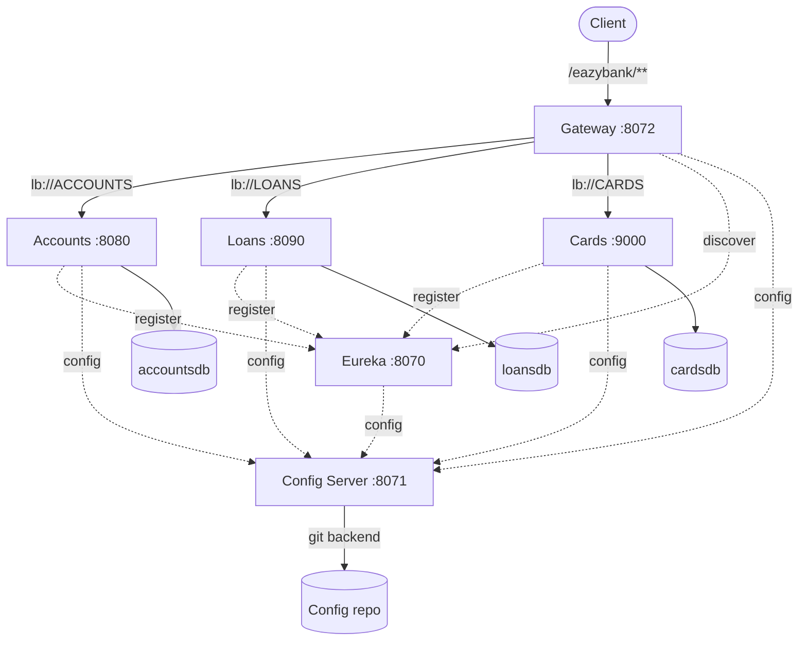

# EazyBank — Spring Cloud Microservices Platform

Six Spring Boot services forming a complete microservices platform: three business services
(**Accounts**, **Loans**, **Cards**) behind an API gateway, with centralized configuration, service
discovery, distributed request tracing, and a health-gated Docker Compose stack for three
environments.

This continues [MicroservicesProject](https://github.com/Kirlmen/MicroservicesProject), which built
the three business services on their own. This repository adds the platform around them — the
infrastructure that turns independent services into a system. Built July 2025 while working through
Spring Cloud patterns, using the [EazyBytes](https://www.eazybytes.com) "EazyBank" course domain as
the problem space.

| | |
|---|---|
| **Stack** | Java 21, Spring Boot 3.5.x, Spring Cloud (Config, Netflix Eureka, Gateway) |
| **Persistence** | MySQL, one database per service |
| **Ops** | Actuator liveness/readiness probes, Docker Compose, health-gated startup |
| **Environments** | `default`, `qa`, `prod` |

---

## Architecture



| Service | Port | Role |
|---|---|---|
| **gatewayserver** | 8072 | Single entry point, routing, correlation IDs |
| **eurekaserver** | 8070 | Service registry and discovery |
| **configserver** | 8071 | Centralized config, backed by an external Git repo |
| **accounts** | 8080 | Customers and their savings accounts |
| **loans** | 8090 | Loan records and balances |
| **cards** | 9000 | Card records and credit limits |

## How a request flows

Everything enters through the gateway at `/eazybank/{service}/**`:

```
GET http://localhost:8072/eazybank/accounts/api/fetch?mobileNumber=1234567890
```

1. `RequestTraceFilter` (a `GlobalFilter`, order 1) checks for an `eazybank-correlation-id` header.
   If absent it generates a UUID and injects it into the request, so every downstream log line for
   that request shares an ID.
2. The route strips the `/eazybank/accounts` prefix via `rewritePath` and forwards to
   `lb://ACCOUNTS` — a logical service name resolved through Eureka and load balanced across
   instances. No hostnames or ports are hardcoded anywhere in the routing.
3. The service handles the request, having pulled its configuration from the config server at
   startup.
4. `ResponseTraceFilter` writes the correlation ID back onto the outbound response, and the route
   adds an `X-Response-Time` header.

## Configuration

`configserver` runs with the `git` profile and serves configuration from an external repository, so
config changes ship without rebuilding an image. Per-service, per-environment files are resolved by
Spring's convention:

```
accounts.yml        accounts-qa.yml        accounts-prod.yml
loans.yml           loans-qa.yml           loans-prod.yml
cards.yml           cards-qa.yml           cards-prod.yml
```

The active profile is set per environment by the Compose stack, so the same images run in all three.

Two values are supplied through the environment rather than committed:

| Variable | Purpose |
|---|---|
| `CONFIG_SERVER_GIT_PRIVATE_KEY` | SSH key for the config server's Git backend |
| `CONFIG_SERVER_ENCRYPT_KEY` | Symmetric key for `{cipher}` values in the config repo |

## Running it

```bash
cd docker-compose/default && docker compose up -d
```

Swap `default` for `qa` or `prod` to run the same images against a different profile. Then:

- Gateway — `http://localhost:8072/eazybank/accounts/api/fetch?mobileNumber=1234567890`
- Eureka dashboard — `http://localhost:8070`
- Config server — `http://localhost:8071/accounts/default`
- Swagger UI — `http://localhost:{service-port}/swagger-ui.html`

Bringing services up in the right order is handled by the stack rather than by retry logic: every
service exposes an Actuator readiness probe, and `depends_on` gates each service on
`condition: service_healthy`. The config server comes up first, then Eureka, then the databases and
business services, then the gateway once all three are registered and healthy.

The Compose files use layered `extends` inheritance to keep that configuration from being repeated
six times:

```
network-deploy-service           attaches to the eazybank network
  └── microservice-base-config       adds memory limits
        └── microservice-configserver-config   adds profile + config server import
              └── microservice-eureka-config       adds Eureka registration
```

Each service then declares only what is genuinely its own: image, ports, database URL, health check.

## Running locally instead

Start the services in dependency order — `configserver` (8071), then `eurekaserver` (8070), then the
business services, then `gatewayserver`:

```bash
cd configserver && ./mvnw spring-boot:run
```

Requires JDK 21 and a MySQL instance per service. Each service's `application.yml` imports
`optional:configserver:http://localhost:8071/`, so it will still start if the config server is down —
useful when working on one service in isolation.

## Status

A learning build, and honest about it. There is no Spring Security layer yet, so the services are
unauthenticated and JPA auditing uses a hardcoded per-service auditor. There is no resilience layer
(circuit breakers, retries, rate limiting) and no distributed tracing backend — correlation IDs are
generated and propagated, but nothing aggregates them yet. Test coverage is limited to the generated
context-load tests.

---

**Volkan** · [github.com/Kirlmen](https://github.com/Kirlmen)
